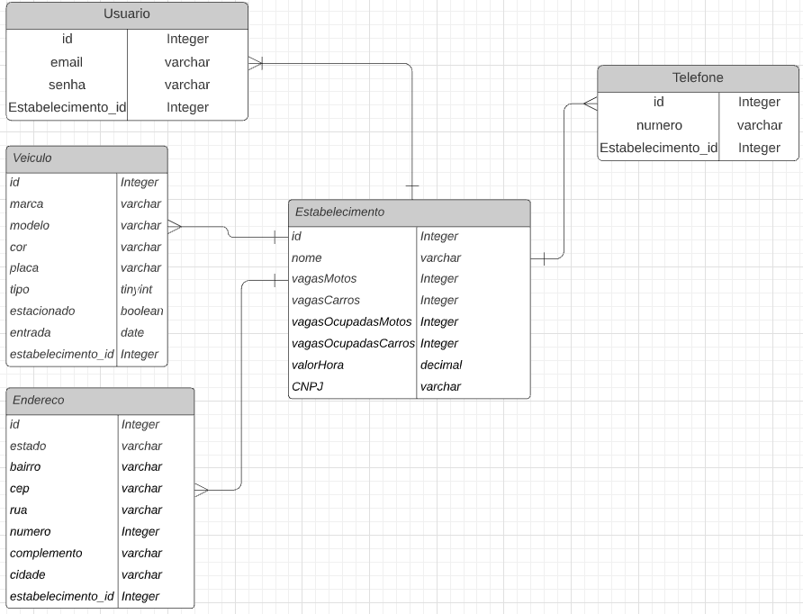

<h1 align="center">Desafio Backend Java Fcamara</h1>
<p align="center">🚗API de gerencimento de estacionamento que
registra a entrada e saida de veiculos🏍️</p>

<p align="center">
    <a href="#obj">Objetivo</a> •
    <a href="#tecnologias">Tecnologias</a> • 
    <a href="#requisito">pré-requisito</a> •
    <a href="#uso">Como usar</a> •
    <a href="#modelagem">Modelagem de dados</a> •
    <a href="#contribuicao">Contribuição</a>
</p>

<h3 id="obj">Objetivo 🚀</h3>
<p>Este projeto tem o objetivo de completar o desafio proposto pela Fcamara, contido na página <a href="https://github.com/fcamarasantos/backend-test-java"> backend-teste-java </a></p>

<h3 id="tecnologias">Tecnologias 🤖</h3>
<li>
<a href="https://www.java.com/pt-BR/download/ie_manual.jsp?locale=pt_BR" alt="Java">Java</a>
</li>
<li><a href="https://swagger.io/" alt="Swagger">Swagger</a></li>
<li><a href="https://junit.org/junit5/" alt="Junit5">Junit5</a></li>
<li><a href="https://hibernate.org/" alt="hibernate">Hibernate</a></li>
<li><a href="https://spring.io/projects/spring-framework" alt="spring-framework">Spring Framework</a></li>
<li><a href="https://maven.apache.org/download.cgi" alt="Maven">Maven</a></li>

<h3 id="requisito">Pré-requisito 👀</h3>
<p>Ter java 1.8 JDK ou superior instalado na máquina</p>

<h3 id="uso">Como usar 📖</h3>

```bash
#Clone este repositorio
$ git clone https://github.com/leandromendes25/desafio-backend.git

#Dentro da pasta server execute o comando:
$ ./mvnw spring-boot:run

#A aplicação será aberta na porta 8080, acesse pela URL do navegador
localhost:8080

#O banco de dados também estará acessivel, caso deseje acessá-lo
localhost:8080/h2-console
#Você poderá ver e testar a aplicação copiando e colando o link abaixo:
http://localhost:8080/swagger-ui.html
```

<h3 id="modelagem">Modelagem de dados 📋</h3>

<h3 id="contribuicao" align="center">Contribuições</h3>
<p align="center">Este projeto foi realizado por <a href="https://www.linkedin.com/in/leandro-mendes1568/">Leandro mendes</a> e <a href="https://www.linkedin.com/in/brunofow/">Bruno campos</a></p>
